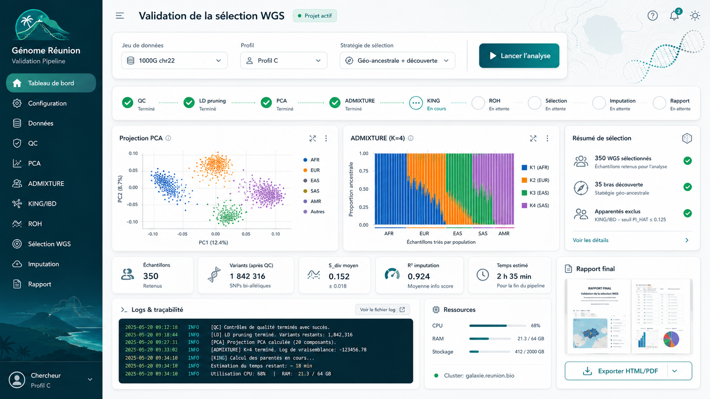

# Génome Réunion — Validation Pipeline App

Scaffold de développement pour transformer le pipeline de validation de la sélection WGS du projet **Génome Réunion** en application de recherche bioinformatique pilotable par interface web.

Objectifs :

- pipeline bioinformatique modulaire ;
- interface web (Flask + vanilla) ;
- système de jobs déclenchés par l'interface ;
- worker sécurisé pour exécuter les analyses ;
- PostgreSQL pour les métadonnées, statuts, scores et audits ;
- Docker Compose pour préparer le déploiement ;
- suivi des runs ;
- rapports HTML/PDF ;
- gestion stricte des fichiers génétiques hors GitHub.

> Ce projet est un démonstrateur de recherche. Il ne réalise aucune interprétation clinique, aucun diagnostic, et ne doit pas être utilisé pour une décision médicale.

## Image de référence de l’interface



## Architecture générale validée

L'utilisateur peut lancer les analyses depuis l'interface, mais l'interface ne doit pas exécuter directement des commandes shell bioinformatiques libres ou bloquantes.

Le flux retenu est :

```text
Interface web (Flask + vanilla)
        ↓
Validation des paramètres
        ↓
Job Manager
        ↓
work/runs/<run_id>/
  ├── config.yaml
  ├── manifest.json
  ├── status.json
  ├── logs/pipeline.log
  ├── outputs/
  └── report/
        ↓
Worker Python local ou Docker
        ↓
Modules bioinformatiques / wrappers sécurisés
        ↓
Résultats / logs / rapports
        ↓
PostgreSQL : statuts, paramètres, scores, audit
        ↓
Interface : progression, résultats ou alerte
```

## Mode local simple

```bash
conda env create -f environment.yml
conda activate genorun-validation
pip install -e .
bash scripts/check_tools.sh
python scripts/init_database.py
flask --app web run --debug
```

Par défaut, la persistance PostgreSQL n'est activée que si `GENORUN_ENABLE_DATABASE=true`.

## Mode Docker recommandé

```bash
cp .env.example .env
docker compose up --build
```

Interface : http://localhost:8000

Services :

```text
genorun-app       interface web (Flask + vanilla)
genorun-worker    worker en boucle
genorun-db        PostgreSQL
```

La base est migrée automatiquement au démarrage du service `genorun-app` via `alembic upgrade head`.

Relancer les migrations manuellement :

```bash
docker compose exec genorun-app conda run -n genorun-validation alembic upgrade head
```

Initialisation rapide hors Alembic, réservée au développement :

```bash
docker compose exec genorun-app conda run -n genorun-validation python scripts/init_database.py
```

## Tester le système de jobs sans interface

Créer un job :

```bash
python scripts/create_demo_job.py
```

Lancer le worker sur le job créé :

```bash
python scripts/run_worker.py --job-id <ID_DU_JOB>
```

Lancer le worker en boucle :

```bash
python scripts/run_worker_loop.py
```

Les sorties sont créées dans :

```text
work/runs/<ID_DU_JOB>/
```

Le mode actuel du worker est un **dry-run sécurisé** : il valide l'architecture job → worker → logs → résultats sans analyser de données génétiques réelles.

## PostgreSQL

PostgreSQL stocke les métadonnées, l'audit et la file de jobs lorsque `GENORUN_ENABLE_DATABASE=true`. Il ne stocke jamais les gros fichiers génétiques.

Tables principales :

```text
projects, cohorts, samples, input_files, analysis_jobs, analysis_steps,
job_logs, software_versions, audit_events, qc_metrics, pca_results,
admixture_results, roh_results, ibd_results, selection_scores,
wgs_selection, reports
```

Voir :

- `docs/05_structure_base_donnees.md`
- `docs/POSTGRESQL_GUIDE_BEGINNER.md`

## Règles Codex / IA

Les règles de développement sont définies dans :

- `AGENTS.md` : règles complètes à respecter par Codex, IA et développeurs (autorité) ;
- `CLAUDE.md` : guide opérationnel pour Claude Code, subordonné à `AGENTS.md` ;
- `.codex/rules.md` : rappel court pour Codex ;
- `docs/CODE_INDEX.md` : index pour localiser rapidement le code ;
- `docs/DEV_TRACKING.md` : suivi des décisions, dettes et erreurs connues ;
- `docs/ROADMAP.md` (+ `docs/ROADMAP_graph.svg`) : phases 0→9 avec portes de test.

Avant tout changement important :

```bash
python -m compileall src scripts web
ruff check src scripts web tests
ruff format --check src scripts web tests
pytest --cov
```

Outils de dev (lint, format, typage, hooks, couverture) :

```bash
pip install -e ".[dev]"
pre-commit install
```

L'intégration continue (`.github/workflows/ci.yml`) rejoue compilation + lint + tests sur chaque PR.

## Données

Les données lourdes ne doivent pas être versionnées dans GitHub. Sont exclus par `.gitignore` et `.dockerignore` : VCF/BCF, fichiers PLINK, BAM/CRAM, bases locales, logs, résultats, rapports générés et dossiers de runs.


## Changements infrastructure v5.4

- Le projet utilise désormais systématiquement `web/` pour l'interface Flask dans les commandes de test, la CI et la documentation.
- Le `Dockerfile` installe le package avec `pip install -e .` afin que les imports `genorun_validation` fonctionnent dans le conteneur.
- `docker-compose.yml` lit les identifiants de développement depuis `.env` ou variables d'environnement.
- La migration Alembic initiale est explicite et auditable.
- Le worker en boucle lit la file de jobs depuis PostgreSQL quand la base est activée, avec fallback filesystem pour le mode local simple.
